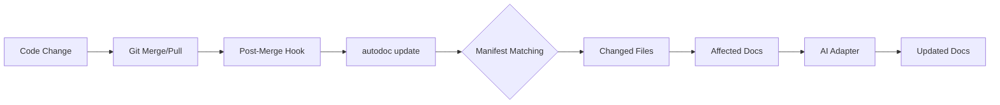
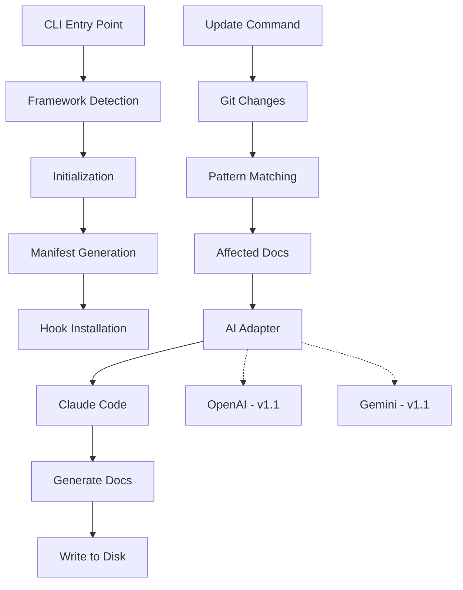

# autodocai

One-command, AI-driven documentation automation for any git repo. Detects your framework, generates a manifest, installs git hooks, and keeps docs in sync with code changes.

```bash
npx autodocai init
```

## Features

- **Framework Detection**: Automatically detects NestJS, Next.js, Laravel, or falls back to generic
- **Manifest-Based Mapping**: Define which code paths affect which docs
- **Git Hook Automation**: Post-merge hook runs doc updates after pulls/merges
- **AI-Driven Updates**: Claude Code adapter generates and updates documentation
- **CI Drift Detection**: GitHub Actions workflow catches out-of-sync docs in PRs
- **Surgical or Rewrite Strategies**: Target specific sections or regenerate entire docs
- **Multiple Package Managers**: Works with npm, yarn, pnpm, and bun

## Quick Start

Initialize in any git repository:

```bash
npx autodocai init
```

This command will:
1. Detect your framework (NestJS, Next.js, Laravel, or generic)
2. Create `.autodoc/manifest.json` with starter mappings
3. Scaffold a `docs/` directory with initial documentation
4. Install a git post-merge hook for automatic updates
5. Add a GitHub Actions workflow for CI checks

After initialization, edit `.autodoc/manifest.json` to customize your documentation mappings.

## How It Works



### The Process

1. **Detection**: `autodoc init` analyzes `package.json` or `composer.json` to identify your framework
2. **Scaffolding**: Creates `.autodoc/manifest.json` with framework-specific mappings and initial `docs/` structure
3. **Bootstrap**: Uses AI adapter to generate initial documentation based on codebase analysis
4. **Hook Installation**: Adds a post-merge git hook that runs `autodoc update --auto` after pulls/merges
5. **Automation**: When code changes, the hook identifies affected docs via glob patterns and triggers AI updates

### Manifest-Based Mapping

The manifest (`.autodoc/manifest.json`) defines relationships between code and docs:

```json
{
  "version": "1.0",
  "project": "my-api",
  "framework": "nestjs",
  "adapter": "claude-code",
  "mappings": [
    {
      "id": "api-reference",
      "doc": "docs/api-reference.md",
      "watches": ["src/**/*.controller.ts", "src/**/*.dto.ts"],
      "purpose": "API endpoint reference with request/response schemas",
      "strategy": "surgical"
    }
  ]
}
```

- **`watches`**: Glob patterns matching files that should trigger this doc update
- **`strategy`**: `surgical` (targeted section edits) or `rewrite` (full regeneration)
- **`purpose`**: Guides the AI on what this documentation should contain

## CLI Reference

### `autodoc init`

Initialize documentation automation in the current repository.

```bash
autodoc init [options]
```

**Options:**
- `--framework <type>` - Force framework type (nestjs, nextjs, laravel, generic)
- `--adapter <name>` - AI adapter to use (default: claude-code)
- `--skip-hooks` - Don't install git hooks
- `--skip-ci` - Don't create GitHub Actions workflow
- `-v, --verbose` - Enable verbose debug logging

**Example:**
```bash
autodoc init --framework nestjs --skip-ci
```

### `autodoc update`

Update documentation based on file changes.

```bash
autodoc update [options]
```

**Options:**
- `--files <paths>` - Comma-separated list of changed files (defaults to git status)
- `--auto` - Non-interactive mode (for git hooks)
- `--dry-run` - Show what would be updated without making changes
- `-v, --verbose` - Enable verbose debug logging

**Example:**
```bash
autodoc update --files "src/users/users.controller.ts,src/users/dto/create-user.dto.ts"
```

**Hook Usage:**
```bash
autodoc update --auto  # Called by post-merge hook
```

### `autodoc check`

Check if documentation is in sync with code (exit code 0 = in sync, 1 = needs update).

```bash
autodoc check [options]
```

**Options:**
- `--files <paths>` - Comma-separated list of changed files (defaults to git diff main)
- `-v, --verbose` - Enable verbose debug logging

**Example:**
```bash
# In CI (GitHub Actions)
autodoc check --files "$CHANGED_FILES"
```

### `autodoc upgrade`

Upgrade configuration to latest version or manage hooks.

```bash
autodoc upgrade [options]
```

**Options:**
- `--remove-hooks` - Remove installed git hooks
- `--reinstall-hooks` - Reinstall git hooks
- `-v, --verbose` - Enable verbose debug logging

**Example:**
```bash
autodoc upgrade --reinstall-hooks
```

### `autodoc doctor`

Diagnose issues with installation and configuration.

```bash
autodoc doctor [options]
```

**Options:**
- `-v, --verbose` - Enable verbose debug logging

**Checks:**
- Git repository status
- Manifest validation
- AI adapter availability
- Git hooks installation
- GitHub Actions workflow presence

**Example:**
```bash
autodoc doctor
```

## Manifest Reference

See [`.autodoc/manifest.json`](.autodoc/manifest.json) after initialization for your framework-specific starter configuration.

### Schema

```typescript
interface Manifest {
  $schema?: string;           // Optional JSON schema URL
  version: '1.0';            // Manifest version
  project: string;           // Project name
  framework: 'nestjs' | 'nextjs' | 'laravel' | 'generic';
  adapter: string;           // AI adapter name (claude-code in v1)
  description?: string;      // Optional project description
  mappings: Mapping[];       // Doc-to-code mappings
  ignore?: string[];         // Glob patterns to ignore
}

interface Mapping {
  id: string;                // Unique kebab-case identifier
  doc: string;               // Path to documentation file (must be under docs/)
  watches: string[];         // Glob patterns for files that trigger this doc
  purpose: string;           // What this documentation covers
  strategy: 'surgical' | 'rewrite';  // Update strategy
}
```

### Strategies

- **`surgical`**: AI updates specific sections while preserving structure. Best for reference docs, API docs, configuration guides. Faster and preserves manual edits outside targeted sections.

- **`rewrite`**: AI regenerates the entire document from scratch. Best for architecture docs, getting started guides, changelogs. Slower but ensures consistency.

### Watch Patterns

Uses [minimatch](https://github.com/isaacs/minimatch) glob syntax:

- `src/**/*.controller.ts` - All controllers recursively
- `src/{users,auth}/**/*.ts` - TypeScript files in users or auth modules
- `*.config.{js,ts}` - Config files in root
- `!**/*.test.ts` - Exclude test files

## Supported Frameworks

| Framework | Detection | Starter Mappings |
|-----------|-----------|------------------|
| **NestJS** | `@nestjs/core` in package.json | API reference, architecture, modules |
| **Next.js** | `next` in package.json | Pages/routes, components, API routes |
| **Laravel** | `laravel/framework` in composer.json | Routes, controllers, models |
| **Generic** | Fallback | README, architecture, API |

Each framework provides an optimized starter manifest with relevant documentation mappings.

## Architecture



### Components

- **CLI Layer** (`src/cli.ts`): Command routing and argument parsing
- **Detection** (`src/detect.ts`): Framework identification from config files
- **Manifest** (`src/manifest.ts`): Schema validation and pattern matching
- **Git Integration** (`src/git.ts`): Hook management and status checking
- **AI Adapters** (`src/adapters/`): Abstract interface for AI providers
  - `claude-code.ts`: Production adapter for Claude Code (v1.0)
  - `openai.stub.ts`: Placeholder for future OpenAI integration
  - `gemini.stub.ts`: Placeholder for future Gemini integration

## FAQ

### Why does this require git?

The automation relies on git hooks to trigger updates and git status to detect changes. For non-git workflows, run `autodoc update --files` manually.

### Can I use this without Claude Code?

Not in v1.0. The OpenAI and Gemini adapters are stubs for future releases. Contributions welcome.

### How do I customize the generated docs?

Edit `.autodoc/manifest.json` to add mappings, change strategies, or adjust watch patterns. Regenerate with `autodoc update`.

### What if the AI gets something wrong?

Use `surgical` strategy to limit scope of changes. Review diffs before committing. Manual edits outside documented sections are preserved in surgical mode.

### Can I disable the git hook temporarily?

Yes, either:
- Rename `.git/hooks/post-merge` to `.git/hooks/post-merge.disabled`
- Run `autodoc upgrade --remove-hooks` (then `--reinstall-hooks` to restore)

### Does this work in monorepos?

Yes, run `autodoc init` in each package that needs documentation. Each package gets its own manifest and hooks.

## Troubleshooting

### `autodoc: command not found`

Use `npx autodocai` instead of `autodoc`, or install globally:

```bash
npm install -g autodocai
```

### Hook not running after git pull

Check hook installation:

```bash
autodoc doctor
```

Verify the hook file exists and is executable:

```bash
ls -la .git/hooks/post-merge
# Should show -rwxr-xr-x permissions
```

Reinstall if needed:

```bash
autodoc upgrade --reinstall-hooks
```

### Manifest validation errors

Run validation check:

```bash
autodoc doctor
```

Common issues:
- Duplicate mapping IDs
- Invalid glob patterns
- Doc paths outside `docs/` directory
- Missing required fields

### AI adapter not available

Ensure Claude Code is installed and in PATH:

```bash
which claude
```

For Claude Code installation instructions, see [claude.ai/download](https://claude.ai/download).

### Performance issues with large repos

- Use more specific watch patterns to reduce file matching
- Use `surgical` strategy instead of `rewrite` where possible
- Add large binary or generated files to `ignore` in manifest
- Consider splitting into multiple manifests for different subsystems

## Contributing

Contributions are welcome. To contribute:

1. Fork the repository
2. Create a feature branch: `git checkout -b feature/your-feature`
3. Make changes with tests: `npm test`
4. Run linter: `npm run lint`
5. Commit with clear messages: `git commit -m "Add feature X"`
6. Push and open a pull request

### Development Setup

```bash
git clone https://github.com/yogesh/autodoc.git
cd autodoc
npm install
npm run build
npm link  # Test CLI locally
```

### Adding a New Framework

1. Add framework type to `src/detect.ts`
2. Create template directory in `src/templates/<framework>/`
3. Add detection logic to `detectFramework()`
4. Create starter manifest and documentation templates
5. Add tests

### Adding a New AI Adapter

1. Implement `AIAdapter` interface from `src/adapters/types.ts`
2. Add adapter file to `src/adapters/<adapter-name>.ts`
3. Register in `src/adapters/index.ts`
4. Update manifest schema to allow new adapter name
5. Add integration tests

See [CONTRIBUTING.md](CONTRIBUTING.md) for detailed guidelines (if available).

## License

MIT - see [LICENSE](LICENSE) for details.

## Links

- [npm package](https://www.npmjs.com/package/autodocai)
- [GitHub repository](https://github.com/yogesh/autodoc)
- [Issue tracker](https://github.com/yogesh/autodoc/issues)
- [Claude Code](https://claude.ai/download)
- [Anthropic](https://www.anthropic.com)

---

Built with Claude Code. Maintained by Yogesh.
